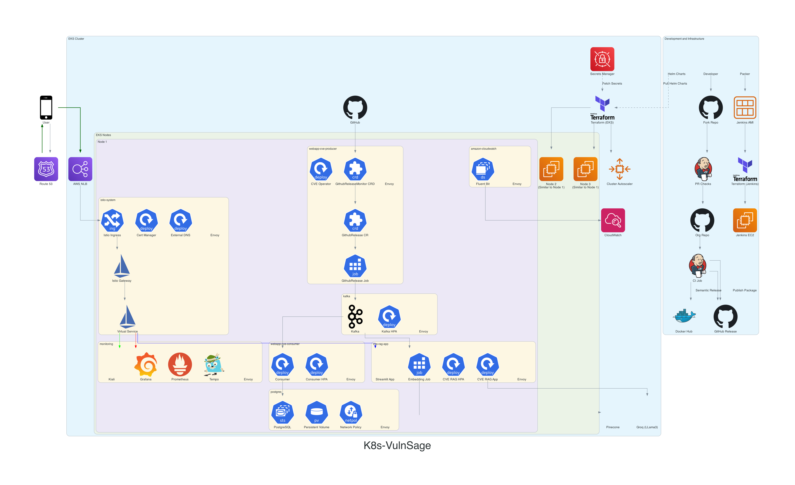

# K8s-VulnSage System Architecture

This repository contains the architecture diagram and documentation for K8s-VulnSage.



## Overview

Our K8s-VulnSage System is a microservices-based architecture deployed on Amazon EKS. It's designed to efficiently collect, process, store, and analyze Common Vulnerabilities and Exposures (CVEs) data.

## Key Components

1. **EKS Cluster**: Hosts all our microservices and supporting components.
2. **Istio**: Provides service mesh capabilities for traffic management and security.
3. **CVE Producer**: Monitors and fetches new CVE releases from GitHub.
4. **Kafka**: Acts as the central event streaming platform.
5. **CVE Consumer**: Processes CVE data from Kafka and stores it in PostgreSQL.
6. **PostgreSQL**: Primary data store for structured CVE data.
7. **CVE RAG App**: AI-powered analysis of CVEs using Retrieval Augmented Generation.
8. **Monitoring Stack**: Includes Grafana, Prometheus, Tempo, and Kiali for observability.

## Generating the Architecture Diagram

The architecture diagram is generated using the `diagrams` Python library. To update or regenerate the diagram:

1. Ensure you have Python 3.7+ installed.

2. Install the required dependencies:
   ```
   pip install diagrams
   ```

3. Run the diagram generation script:
   ```
   python main.py
   ```

4. The output will be saved as `k8s-vulnsage.png` in the current directory.

## Architecture Details

### Development Workflow
- Developers fork the repository and create pull requests.
- Jenkins runs PR checks (lint, format, semantic versioning).
- CI/CD pipeline builds containers and pushes to Docker Hub.
- Semantic releases are created on GitHub.

### Infrastructure Provisioning
- Packer creates Jenkins AMI.
- Terraform provisions Jenkins EC2 and EKS cluster.

### EKS Cluster Namespaces
- istio-system
- webapp-cve-producer
- kafka
- webapp-cve-consumer
- postgres
- monitoring
- cve-rag-app
- amazon-cloudwatch

### Data Flow
1. GitHub Release Monitor detects new CVE releases.
2. Kubernetes job downloads CVE data and publishes to Kafka.
3. CVE consumer reads from Kafka and stores in PostgreSQL.
4. CVE RAG app processes data for AI-powered analysis.

### Security
- AWS Secrets Manager: Manages sensitive information securely, ensuring that secrets are stored and accessed in a controlled manner.
- SOPS: Used for managing secrets within configuration files, enabling encryption and secure handling of secrets in version control systems.
- Istio: Ensures secure service-to-service communication within the service mesh by providing mutual TLS, authentication, and authorization.
- Network Policies: Restrict unnecessary communication between pods, enhancing security by limiting exposure to only what is necessary.
- Cert-Manager: Used to implement HTTPS by automating the issuance and renewal of TLS certificates, ensuring secure communication for all services.

### Monitoring and Observability
- Grafana, Prometheus, and Tempo: Used for monitoring and tracing. Grafana provides a centralized dashboard for visualizing metrics and logs, Prometheus handles metrics collection and storage, and Tempo is used for distributed tracing.
- Kiali: Facilitates service mesh visualization, allowing for better understanding and management of the service mesh within the architecture.
- Fluent Bit: Logs are exported to AWS CloudWatch, ensuring that all logs are centralized and easily accessible for analysis and troubleshooting.
- OpenTelemetry: Implemented for tracing, providing end-to-end visibility into the system by collecting, processing, and exporting traces across the entire application stack.

## Contributing

To contribute to the architecture:

1. Fork this repository.
2. Make your changes to the diagram generation script or documentation.
3. Generate a new diagram if necessary.
4. Create a pull request with your changes.

Please ensure any changes are well-documented and align with the overall system design principles.

## License

This project is licensed under the MIT License - see the [LICENSE](LICENSE) file for details.
