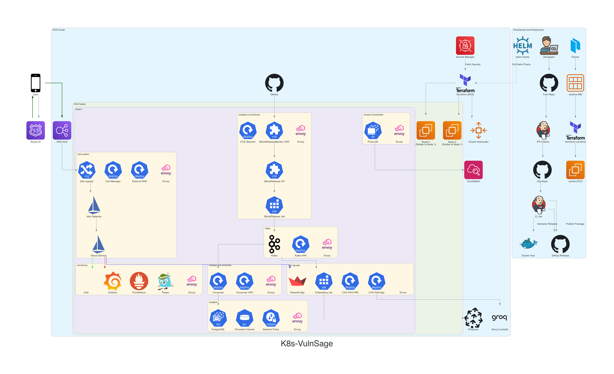

# CVE Management System Architecture

This repository contains the architecture diagram and documentation for K8s-VulnSage.



## Overview

Our CVE Management System is a microservices-based architecture deployed on Amazon EKS. It's designed to efficiently collect, process, store, and analyze Common Vulnerabilities and Exposures (CVEs) data.

## Key Components

1. **EKS Cluster**: Hosts all our microservices and supporting components.
2. **Istio**: Provides service mesh capabilities for traffic management and security.
3. **CVE Producer**: Monitors and fetches new CVE releases from GitHub.
4. **Kafka**: Acts as the central event streaming platform.
5. **CVE Consumer**: Processes CVE data from Kafka and stores it in PostgreSQL.
6. **PostgreSQL**: Primary data store for structured CVE data.
7. **CVE RAG App**: AI-powered analysis of CVEs using Retrieval Augmented Generation.
8. **Monitoring Stack**: Includes Grafana, Prometheus, Tempo, and Kiali for observability.

## Generating the Architecture Diagram

The architecture diagram is generated using the `diagrams` Python library. To update or regenerate the diagram:

1. Ensure you have Python 3.7+ installed.

2. Install the required dependencies:
   ```
   pip install diagrams
   ```

3. Run the diagram generation script:
   ```
   python main.py
   ```

4. The output will be saved as `k8s-vulnsage.png` in the current directory.

## Architecture Details

### Development Workflow
- Developers fork the repository and create pull requests.
- Jenkins runs PR checks (lint, format, semantic versioning).
- CI/CD pipeline builds containers and pushes to Docker Hub.
- Semantic releases are created on GitHub.

### Infrastructure Provisioning
- Packer creates Jenkins AMI.
- Terraform provisions Jenkins EC2 and EKS cluster.

### EKS Cluster Namespaces
- istio-system
- webapp-cve-producer
- kafka
- webapp-cve-consumer
- postgres
- monitoring
- cve-rag-app
- amazon-cloudwatch

### Data Flow
1. GitHub Release Monitor detects new CVE releases.
2. Kubernetes job downloads CVE data and publishes to Kafka.
3. CVE consumer reads from Kafka and stores in PostgreSQL.
4. CVE RAG app processes data for AI-powered analysis.

### Security
- AWS Secrets Manager for secret management.
- Istio for secure service-to-service communication.
- Network policies restrict unnecessary communication.

### Monitoring and Observability
- Grafana, Prometheus, and Tempo for monitoring and tracing.
- Kiali for service mesh visualization.
- Fluent Bit exports logs to AWS CloudWatch.

## Contributing

To contribute to the architecture:

1. Fork this repository.
2. Make your changes to the diagram generation script or documentation.
3. Generate a new diagram if necessary.
4. Create a pull request with your changes.

Please ensure any changes are well-documented and align with the overall system design principles.

## License

This project is licensed under the MIT License - see the [LICENSE](LICENSE) file for details.